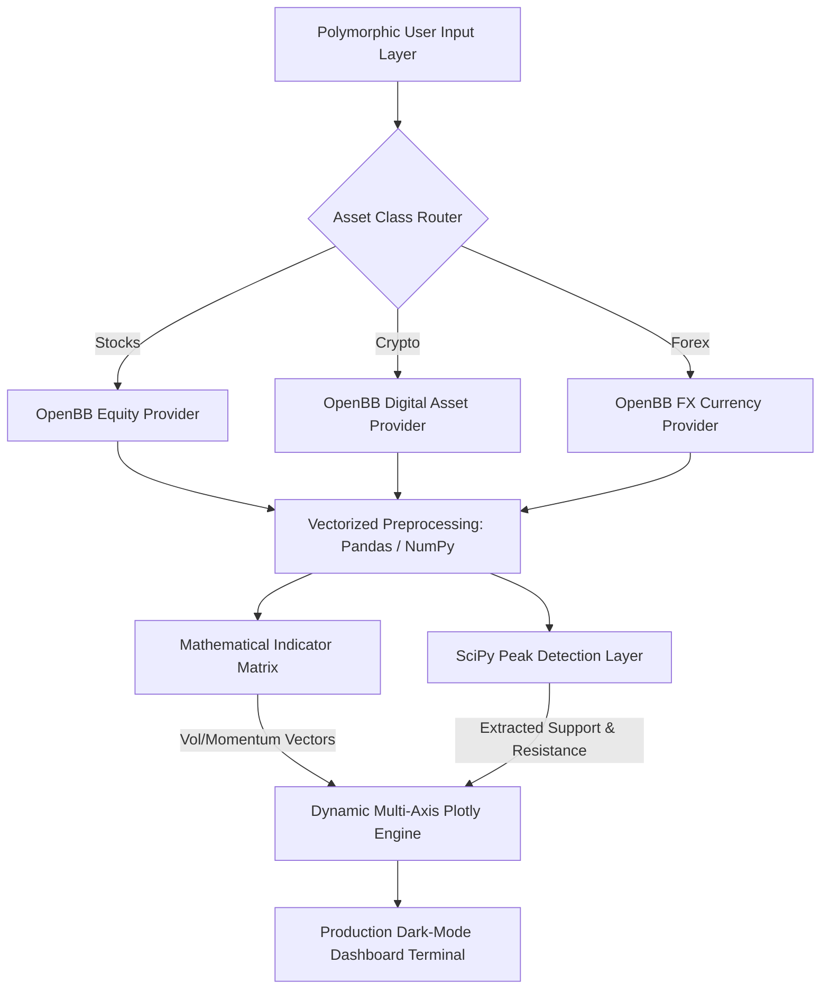

# 📊 Cross-Market Intelligence & Multi-Asset Analytics Engine

[](https://github.com/Vipeen21)
[](https://github.com/Vipeen21/Multi-Asset-Analyst/stargazers)
[](https://github.com/Vipeen21/Multi-Asset-Analyst/network/members)
[](https://github.com/Vipeen21/Multi-Asset-Analyst/blob/main/LICENSE)

<p align="left">
  
  
  
  
  
  
</p>

An advanced quantitative market surveillance platform designed to ingest, parse, and analyze mathematical price signals across diverse financial domains. This engine unifies **Equities (Stocks), Cryptocurrencies, and Foreign Exchange (Forex)** data streams into an interactive multi-axis visual intelligence layer.

---

## 🎯 Flagship Capabilities

### 1. Unified Cross-Market Ingestion Pipeline
Traditional trading infrastructure is heavily fragmented. This engine utilizes the **OpenBB SDK framework** linked with high-fidelity financial data providers to dynamically process market matrices based on polymorphic runtime user inputs (`stocks`, `crypto`, `forex`).

### 2. Algorithmic Signal Processing & Peak Detection
Rather than using arbitrary visual charting techniques, the platform deploys **SciPy digital signal processing algorithms** (`scipy.signal.find_peaks`) to scan historical price arrays. By measuring local mathematical prominence relative to data variance ($\sigma$), it programmatically isolates high-probability support and resistance inflection points.

---

## 🏗️ Pipeline Architecture & System Design

The application decouples runtime API stream configuration from localized mathematical computation and visual chart orchestration:



---

## 📊 Indicator Mathematical Matrix & Specification

To maintain institutional-grade analytical depth, every metric generated by the engine is fully vectorized across historical time-series dataframes:

| Indicator Block | Core Mathematical Concept | Financial Use Case | Strategic Edge |
| --- | --- | --- | --- |
| **Bollinger Bands** | $\mu \pm k \cdot \sigma$ (20-day standard deviation scaling) | Volatility regime mapping & asset compression tracking | Accurately identifies market expansion phases via normalized band-width metrics. |
| **RSI** | $100 - \frac{100}{1 + \text{RS}}$ (14-day momentum velocity) | Trend overextension & momentum saturation detection | Eliminates lag to classify market states into strict Overbought, Oversold, or Neutral vectors. |
| **MACD** | $\text{EMA}_{12} - \text{EMA}_{26}$ (Exponential variance mapping) | Structural momentum direction and velocity shifts | Isolates bullish/bearish divergence patterns before price breakout confirmations. |
| **ATR** | Exponential/Simple moving average of True Range | Non-directional structural risk metrics | Quantifies absolute baseline market noise to construct dynamic risk boundaries. |

---

## 📂 Repository Blueprint

```text
├── multi-asset-analysis.py       # Main orchestration engine, indicator matrix, and UI layer
├── requirements.txt              # Production-validated technical stack dependencies
├── model_output_sample.png       # High-resolution output sample of the 5-tier dashboard
└── README.md                     # Technical repository documentation

```

---

## ⚡ Quick Start & Installation

Launch the quantitative analytics engine environment locally in under two minutes:

```bash
# 1. Clone the repository
git clone [https://github.com/Vipeen21/Multi-Asset-Analyst.git](https://github.com/Vipeen21/Multi-Asset-Analyst.git)
cd Multi-Asset-Analyst

# 2. Install validated quantitative and mathematical packages
pip install openbb pandas numpy plotly scipy

# 3. Fire up the interactive analytics prompt
python multi-asset-analysis.py

```

---

## 🔮 Future Roadmap & Enterprise Scaling

* [ ] **Statistical Arbitrage Engine:** Integrate cointegration checks across incoming currency pairs to generate live pair-trading strategies.
* [ ] **Asynchronous Stream Workers:** Migrating ingestion loops to an async pattern to track real-time WebSocket market tickers concurrently.
* [ ] **Machine Learning Overlay:** Deploy an online-learning LSTM model layer to generate dynamic 5-day horizon trend predictions.

---

## 🤝 Connect & Collaborate

If this platform enhances your market surveillance workflows or quantitative analysis research, **consider leaving a star!** ⭐

* **Author:** Vipeen Kumar
* **LinkedIn:** [Profile Link](https://www.google.com/search?q=https://linkedin.com/in/vipeen-kumar-908212b8)
* **Portfolio Website:** [vipeen21.github.io](https://www.google.com/search?q=https://vipeen21.github.io)

`#QuantitativeFinance` `#TechnicalAnalysis` `#DataScience` `#OpenBB` `#MarketSurveillance` `#FinTech` `#DataVisualization`

